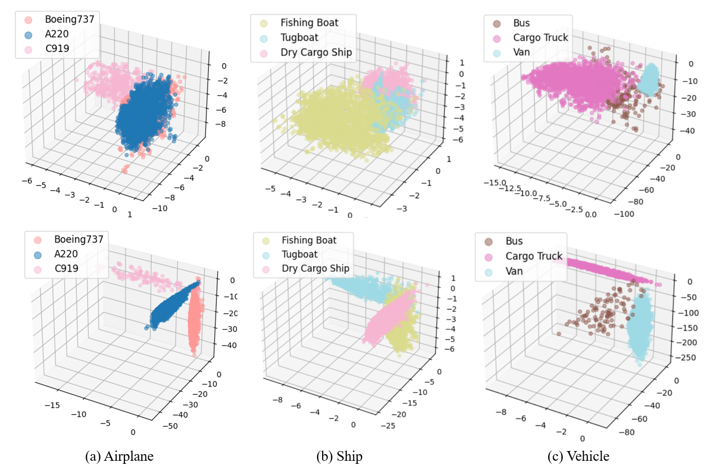

# Enhancing Fine-grained Object Detection in Aerial Images via Orthogonal Mapping
This is the official implementation of the paper "Enhancing Fine-grained Object Detection in Aerial Images via Orthogonal Mapping".

## :white_check_mark: Updates
* **`June. 9th, 2024`**: Update: **Important!** we release the **FCOS w/ OM**, **RetinaNet w/ OM**, **Faster R-CNN w/ OM**, and **PETDet w/ OM** models.

## Introduction
Orthogonal Mapping (OM) is a simple yet effective method that can be deployed on both one-stage and two-stage networks to mitigate semantic confusion.

**Abstract**: Fine-Grained Object Detection (FGOD) is a critical task in high-resolution aerial image analysis. This letter introduces Orthogonal Mapping (OM), a simple yet effective method aimed at addressing the challenge of semantic confusion inherent in FGOD. OM introduces orthogonal constraints in the feature space by decoupling features from the last layer of the classification branch with a class-wise orthogonal vector basis. This effectively mitigates semantic confusion and enhances classification accuracy. Moreover, OM can be seamlessly integrated into mainstream object detectors. Extensive experiments conducted on three FGOD datasets (FAIR1M, ShipRSImageNet, and MAR20) demonstrate the effectiveness and superiority of the proposed approach. Notably, with just one line of code, OM achieves a 4.08\% improvement in mean Average Precision (mAP) over FCOS on the ShipRSImageNet dataset.

<div align=center>

</div>

## Methodology
- Step 1: Construct the orthogonal class prototype feature

```shell script
A = np.random.rand(self.feat_channels, self.feat_channels)
orthogonal_basis = orth(A)
remaining_basis_vectors = orthogonal_basis[:self.cls_out_channels,:]
self.prototype = torch.Tensor(remaining_basis_vectors)
self.prototype = self.prototype / self.prototype.norm(dim=-1, keepdim=True)
```

- Step 2: Replace convolutional or fully connected layers with orthogonal prototypes

```shell script
image_feats = feats_ori / feats_ori.norm(dim=1, keepdim=True)
orth_feats = self.prototype.to(feats_ori.dtype).to(feats_ori.device)
# ori: cls_score = conv_cls(image_feats)
cls_score = 100 * torch.einsum('bcwh, nc->bnwh', image_feats, orth_feats)
```


## Installation and Get Started
[](https://www.python.org/)
[](https://pytorch.org/)

Required environments:
* Linux
* Python 3.10+
* PyTorch 1.13+
* CUDA 9.2+
* GCC 5+
* [MMCV](https://mmcv.readthedocs.io/en/latest/#installation)
* [PETDet](https://github.com/canoe-Z/PETDet)

Install:

Note that this repository is based on the [MMrotate](https://github.com/open-mmlab/mmrotate) and [PETDet](https://github.com/canoe-Z/PETDet). Assume that your environment has satisfied the above requirements, please follow the following steps for installation.

```shell script
git clone https://github.com/ZhuHaoranEIS/Orthogonal-FGOD.git
cd Orthogonal-FGOD
pip install -r requirements/build.txt
python setup.py develop
```

## Data Preparation
Download datassts:
- [FAIR1M Dataset](https://www.gaofen-challenge.com/benchmark)
- [MAR20 Dataset](https://gcheng-nwpu.github.io/)
- [ShipRSImageNet Dataset](https://github.com/zzndream/ShipRSImageNet)  
  
For FAIR1M, Please crop the original images into 1024×1024 patches with an overlap of 200 by run the [split tool](https://github.com/canoe-Z/PETDet/blob/dev/tools/data/README.md).

The data structure is as follows:

```none
Orthogonal-FGOD
├── mmrotate
├── tools
├── configs
├── data
|   ├── FAIR1M1_0
│   │   ├── train
│   │   ├── test
│   ├── FAIR1M2_0
│   │   ├── train
│   │   ├── val
│   │   ├── test
│   ├── MAR20
│   │   ├── Annotations
│   │   ├── ImageSets
│   │   ├── JPEGImages
│   ├── ShipRSImageNet
│   │   ├── COCO_Format
│   │   ├── VOC_Format
```

## Training

All models of OM are trained with a total batch size of 8 (can be adjusted following [MMrotate](https://github.com/open-mmlab/mmrotate)). 

- To train FCOS w/ OM and PETDet w/ OM on FAIR1M-v1.0, run

```shell script
python tools/train.py fari1mv1/fcos_w_om.py
python tools/train.py fari1mv1/petdet_w_om.py
```
Please refer to 
[fari1mv1/fcos_w_om.py](https://github.com/ZhuHaoranEIS/Orthogonal-FGOD/blob/main/configs/orth_guided/fair1m_sub/fcos/rotated_fcos_orth.py),
[fari1mv1/petdet_w_om.py](https://github.com/ZhuHaoranEIS/Orthogonal-FGOD/blob/main/configs/orth_guided/fair1m_sub/petdet/petdetv1.py),  
for model configuration

## Inference

Assuming you have put the splited FAIR1M dataset into `data/split_ss_fair1m2_0/` and have downloaded the models into the `weights/`, you can now evaluate the models on the FAIR1M_v1.0 test split:

```
python tools/test.py configs/.py work_dirs/.pth --format-only --eval-options submission_dir=submit/
```

Then, you can upload `work_dirs/FAIR1M_1.0_results/submission_zip/test.zip` to [ISPRS Benchmark](https://www.gaofen-challenge.com/benchmark).

## Main results
Table 1. Comparison results on FAIR1M-v1.0 online validation. All the models are with ResNet-50 as the backbone. Moreover, FRCNN, ORCNN, and RoI Trans denote Faster R-CNN, Oriented R-CNN, and RoI Transformer respectively.


Table 2. Comparison results between our OM and other SOTA orthogonal losses on the ShipRSImageNet.


Figure 1. Confusion matrices of detection results (\%) obtained from FCOS w/o OM (top) and FCOS w/ OM (bottom). The horizontal and vertical coordinates represent the ground truth labels and the prediction labels. (a) Airplane. (b) Ship. (c) Vehicle.


Figure 2. The three-dimensional distribution of three main easily confused classes in FAIR1M-v1.0 obtained from FCOS w/o OM (top) and FCOS w/ OM (bottom). (a) Airplane. (b) Ship. (c) Vehicle.


## Citation
If you find this work helpful, please consider citing:
```bibtex
@misc{zhu2024enhancingfinegrainedobjectdetection,
      title={Enhancing Fine-grained Object Detection in Aerial Images via Orthogonal Mapping}, 
      author={Haoran Zhu and Yifan Zhou and Chang Xu and Ruixiang Zhang and Wen Yang},
      year={2024},
      eprint={2407.17738},
      archivePrefix={arXiv},
      primaryClass={cs.CV},
      url={https://arxiv.org/abs/2407.17738}, 
}
```
